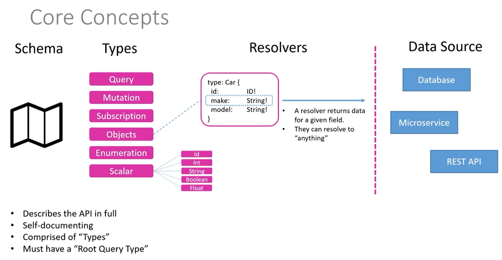
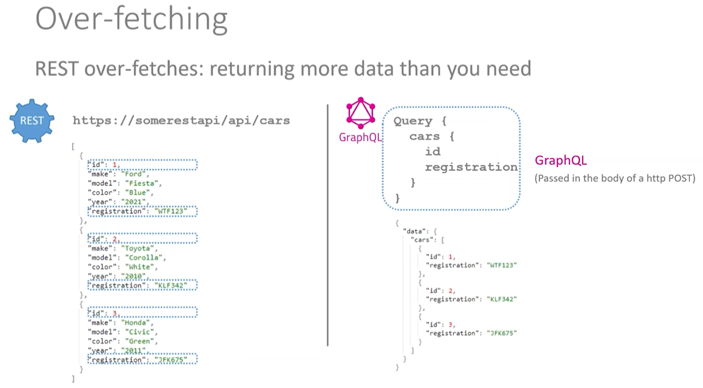
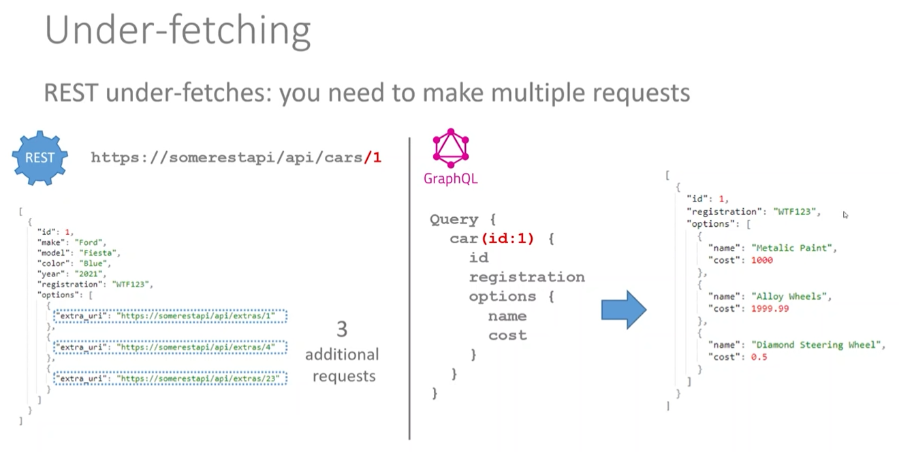
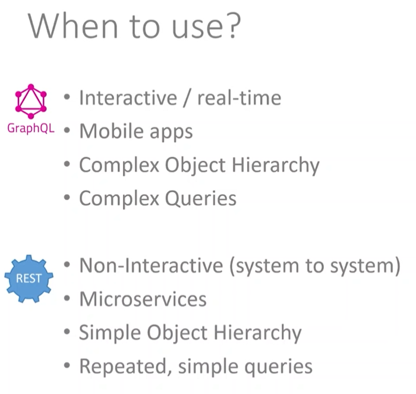
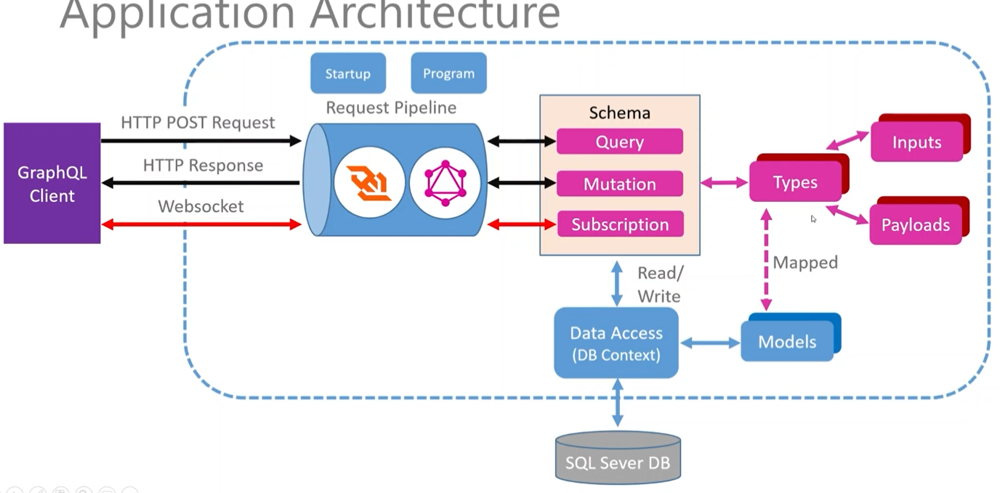

## Overview
A GraphQL API with .NET 5 and Hot Chocolate based on this [Youtube tutorial](https://www.youtube.com/watch?v=HuN94qNwQmM)

## Graph QL core concepts


## Graph QL vs REST

### Overfetching


### Underfetching


### When to use


## Application architecture


## Setup

- start sql server
```
docker-compose up -d
```

- install _dotnet ef_
```
dotnet tool install --global dotnet-ef --version 5.0.17
```

- apply migrations
```
dotnet ef database update
```

- run application
```
dotnet run
```

- access endpoint: http://localhost:5000/graphql. This will open the _Banana Cake Pop_ UI. Alternatively, Postman or Insomnia can be used

- run query 1
```
query {
	platform {
		id
		name
		commands {
			id
			howTo
			commandLine
		}
	}
}
```

- run query 2
```
query {
	command {
		id
		howTo
		commandLine
		platform {
			name
		}
	}
}
```

- access endpoint: http://localhost:5000/graphql-voyager. This will display the schema.