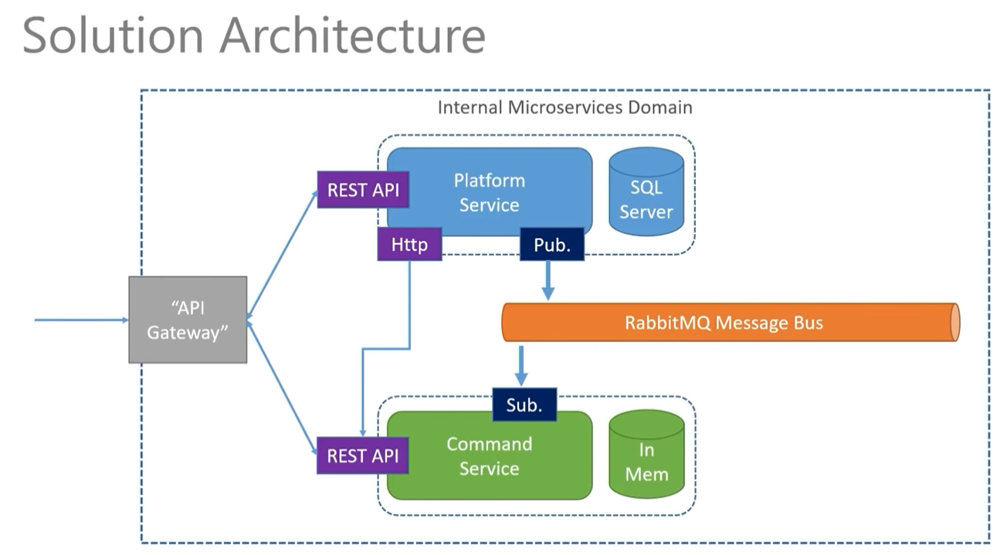
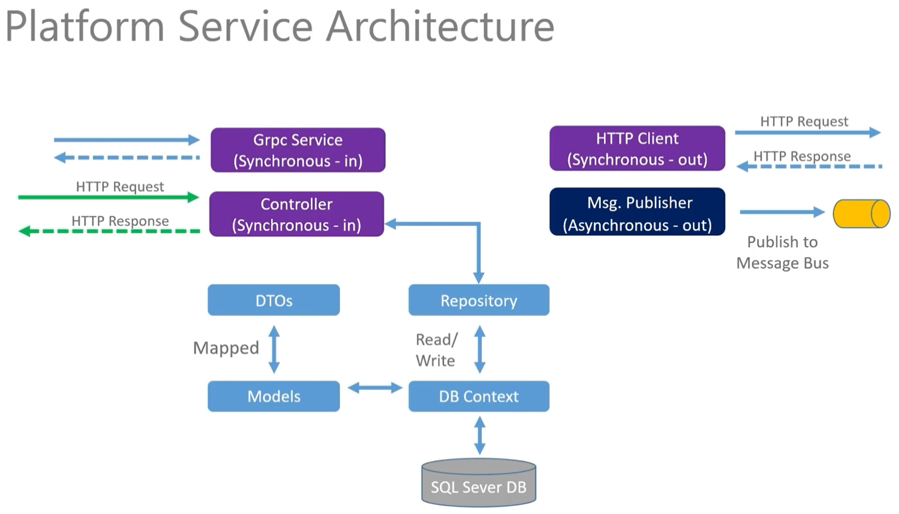
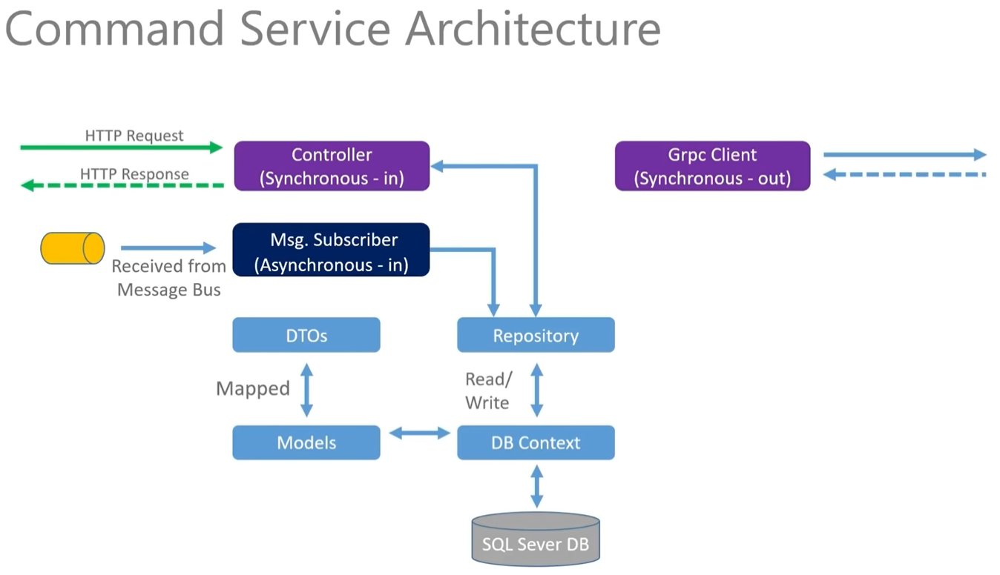
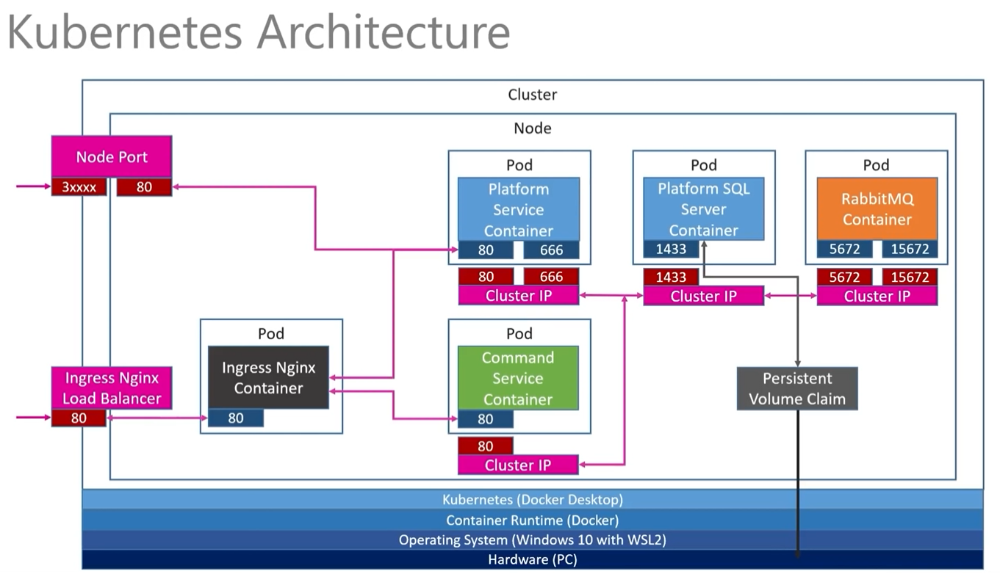

## Overview

Implemenation of 2 microservices using HTTP and GRPC APIs, asyncronous messaging with RabbitMQ, deployed on Kubernetes. Based on this [.NET Microservices – Full Course](https://www.youtube.com/watch?v=DgVjEo3OGBI)

- Building two .NET Microservices using the REST API pattern
- Working with dedicated persistence layers for both services
- Deploying our services to Kubernetes cluster
- Employing the API Gateway pattern to route to our services
- Building Synchronous messaging between services (HTTP & gRPC)
- Building Asynchronous messaging between services using an Event Bus (RabbitMQ)

## Architecture






## Setup

### Docker

The images will be pushed to Docker Hub.

- build platform service image

```
docker build -t YOUR_DOCKERHUB_USER/platformservice .
```

- run platform service

```
docker run -p 8080:80 -d YOUR_DOCKERHUB_USER/platformservice
```

- push image to Docker Hub

```
docker push YOUR_DOCKERHUB_USER/platformservice
```

- build commands service image

```
docker build -t YOUR_DOCKERHUB_USER/commandsservice .
```

- run commands service

```
docker run -p 8081:80 -d YOUR_DOCKERHUB_USER/commandsservice
```

- push image to Docker Hub

```
docker push YOUR_DOCKERHUB_USER/commandsservice
```

### Kubernetes

- check that the option "Enable Kubernetes" is checked in DockerDesktop app

- deploy platform service

```
kubectl apply -f platforms-depl.yaml
```

- deploy commands service

```
kubectl apply -f commands-depl.yaml
```

- install ingress-nginx

```
kubectl apply -f https://raw.githubusercontent.com/kubernetes/ingress-nginx/controller-v1.4.0/deploy/static/provider/cloud/deploy.yaml
```

- modify _hosts_ file to add an entry fro acme.com

- deploy the ingress for our services

```
kubectl apply -f ingress-srv.yaml
```

- deploy the pvc claim for MSSQL

```
kubectl apply -f local-pvc.yaml
```

- create secret for MSSQL password

```
kubectl create secret generic mssql --from-literal=SA_PASSWORD="pa55w0rd!"
```

- deploy MSSQL server with a load balancer to access it from local machine

```
kubectl apply -f mssql-platform-depl.yaml
```

- perform a GET on http://acme.com/api/platforms
