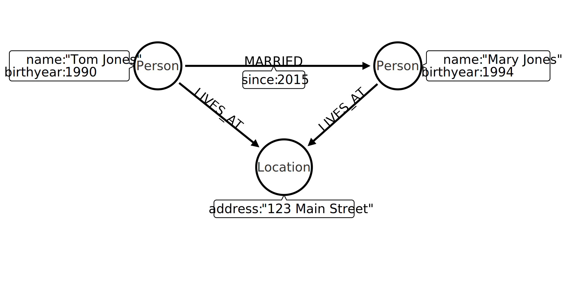

[Graph Data Modeling for Neo4j](#graph-data-modeling-for-neo4j)

[Introduction to Neo4j 4.0](#introduction-to-neo4j-4.0)

# Graph Data Modeling for Neo4j

## Introduction to Graph Data Modeling

- **Nodes** should have **labels** to categorize entities
- **Nodes** and **relationships** can have **properties**
- [Arrow Tool](http://www.apcjones.com/arrows/) to model a graph database



## Designing the Initial Graph Data Model
    1. Understanding the domain
    2. Create high-level sample data
    3. Define specific questions for the application
    4. Identify entities
    5. Identify connections between entities
    6. Test the questions against the model
    7. Test scalability

## Graph Data Modeling Core Principles

### Best practices for modeling nodes
 - Uniqueness of nodes
 - Use fanout judiciously for complex data. use fanout to do one of two things:
    - Reduce duplication of properties. Instead of having a repeated property on every node, you can instead have all of those nodes connected to a shared node with that property. This can make data updates massively easier.
    - Reduce gather-and-inspect behavior during a traversal to reduce "wasted" hops

### Best practices for modeling relationships    
- Using specific relationship types.
- Reducing symmetric relationships.
- Using types vs. properties.

### Property best practices
 - Property lookups have a cost.
- Parsing a complex property adds more cost.
- Anchors and properties used for traversal should be as simple as possible.
- Identifiers, outputs, and decoration are OK as complex values.

### Hierarchy of accessibility

1. Anchor node label, indexed anchor node properties
2. Relationship types
3. Non-indexed anchor node properties
4. Downstream node labels
5. Relationship properties, downstream node properties

Query performance is not the only metric that matters! Query simplicity, write/update speed, and the human-intuitiveness of a model are also important factors.

## Common Graph Structures

- Intermediate nodes
    - to model a relationship that connects more than two nodes
    - sharing data
    - organizing data

- Linked lists
    - never use a doubly-linked list in Neo4j because doubly-linked lists use redundant symmetrical relationships.

- Timeline trees
    - each node contains the Year, Month, Day
- Multiple structures in a single graph

## Refactoring and Evolving a Model

Data models can be optimized for one of four things:

- Query performance
- Model simplicity & intuitiveness
- Query simplicity (i.e., simpler Cypher strings)
- Easy data updates

| Goal | Refactor example |
| ----------- | ----------- |
| Eliminate duplicate data in properties | Extracting nodes from properties |
| Use labels instead of property values | Turn property values into labels for nodes |
| Use nodes instead of properties for relationships | Extract nodes from relationship properties |

# Introduction to Neo4j 4.0

## The Neo4j Graph Platform

- Neo4j DBMS
    - Index-free adjacency - when a node or relationship is written to the database, it is stored in the database as connected and any subsequent access to the data is done using pointer navigation which is very fast
    - ACID (Atomic, Consistent, Isolated, Durable)
    - Clusters - provide high availability, scalability for read access to the data, and failover which is important to many enterprises
    - Graph engine - used to interpret Cypher statements and also executes kernel-level code to store and retrieve data, whether it is on disk, or cached in memory.

- Neo4j Aura
    - Simplest way to run the Neo4j DBMS in the cloud
    - Completely automated and fully-managed, Neo4j Aura delivers the world’s most flexible, reliable and developer-friendly graph database as a service

- Neo4j Sandbox
    - a free, temporary, and cloud-based instance of a Neo4j Server
    - available for three days, but you can extend it for up to 10 days

- Neo4j Desktop
    ```
    :play
    :help commands
    :history
    :clear
    ```

- Neo4j graph applications

- Neo4j Browser

- Neo4j Bloom

- cypher-shell
    - a command-line tool that you can use to connect to a Neo4j DBMS instance and run Cypher statements against the database

- Neo4j libraries
    - Awesome Procedures of Cypher (APOC). This library has close to 500 procedures and functions that extend Cypher in ways that make your programming in Cypher much easier for complex tasks
    - GraphQL is an open-source query language for querying parts of a graph.It is not as flexible or powerful as Cypher

- Neo4j drivers

- Neo4j integration

- Neo4j administration tools
    - cypher-shell - Create, start, stop, and drop a particular database as well as query the “user” database.
    - neo4j - Start, stop and retrieve the status of the Neo4j DBMS instance.
    - neo4j-admin - Create, copy, remove, backup, restore and perform other administrative tasks.

## Introduction to Cypher

- a node can have multiple labels
- when you specify a pattern for a MATCH clause, you should always specify a node label if possible. In doing so, the graph engine uses an index to retrieve the nodes
- A property is defined for a node and not for a type of node. All nodes of the same type need not have the same properties.


    ```
    CREATE INDEX [IndexName]  FOR (n:LabelName) ON (n.propertyName) // create an index
    CREATE CONSTRAINT ON (n:<LabelName>) ASSERT n.<propertyKey> IS UNIQUE
    CALL dbms.functions() // list functions
    CALL db.schema.visualization() // show metadata graph
    :schema / display constraints and indexes
    CALL db.labels() // list node labels
    CALL db.propertyKeys() // lsit proeprty keys of all nodes
    ```

    ```
    MATCH (n) RETURN n LIMIT 25 // first 25 nodes with any label
    MATCH (p:Person) RETURN p.name LIMIT 5 // first 5 Person nodes
    MATCH (n:Movie) RETURN n LIMIT 25
    MATCH p=()-[r:DIRECTED]->() RETURN p LIMIT 5 // all nodes that have DIRECTED relationship between them
    MATCH (n1)-[r]->(n2) RETURN r, n1, n2 LIMIT 25 // get some data
    MATCH (n) RETURN count(n) // count all nodes
    MATCH ()-->() RETURN count(*); // count all relationships
    MATCH (n) DETACH DELETE n // delete nodes and relationships
    MATCH (m:Movie {released: 2003, tagline: 'Free your mind'}) RETURN m // filter by properties
    MATCH (p:Person {born: 1965}) RETURN p.name AS Name, p.born AS `birth year` // return multiple properties
    MATCH (p:Person)-[rel:ACTED_IN]->(m:Movie {title: 'The Matrix'}) RETURN p, rel, m 
    MATCH (p:Person {name: 'Tom Hanks'})-[:ACTED_IN|DIRECTED]->(m:Movie) RETURN p.name, m.title
    MATCH (p:Person)-[:ACTED_IN]->(:Movie {title: 'The Matrix'})
    RETURN p.name // movie is anonymous node since is not used later in the query
    MATCH (p:Person)--(m:Movie {title: 'The Matrix'}) RETURN p, m // anonymous relationships
    MATCH (p:Person)-[:REVIEWED {rating: 65}]->(:Movie {title: 'The Da Vinci Code'}) RETURN p.name 
    MATCH  (p:Person)-[:FOLLOWS]->(:Person)-[:FOLLOWS]->(:Person {name:'Jessica Thompson'}) RETURN p // followers of the followers
    ```
    ```
    // to clear a database
    :USE system
    CREATE OR REPLACE DATABASE neo4j
    :USE neo4j
    ```

Cypher style recommendations

- Node labels are CamelCase and begin with an upper-case letter (examples: Person, NetworkAddress). Note that node labels are case-sensitive.
- Property keys, variables, parameters, aliases, and functions are camelCase and begin with a lower-case letter (examples: businessAddress, title). Note that these elements are case-sensitive.
- Relationship types are in upper-case and can use the underscore. (examples: ACTED_IN, FOLLOWS). Note that relationship types are case-sensitive and that you cannot use the “-” character in a relationship type.
- Cypher keywords are upper-case (examples: MATCH, RETURN). Note that Cypher keywords are case-insensitive, but a best practice is to use upper-case.
- String constants are in single quotes, unless the string contains a quote or apostrophe (examples: ‘The Matrix’, “Something’s Gotta Give”). Note that you can also escape single or double quotes within strings that are quoted with the same using a backslash character.
- Specify variables only when needed for use later in the Cypher statement.
- Place named nodes and relationships (that use variables) before anonymous nodes and relationships in your MATCH clauses when possible.
- Specify anonymous relationships with -->, --, or <--    

## Using WHERE to Filter Queries

```
MATCH (p:Person)-[:ACTED_IN]->(m:Movie)
WHERE m.released >= 2003 AND m.released <= 2004
RETURN p.name, m.title, m.released

MATCH (p:Person)-[:ACTED_IN]->(m:Movie)
WHERE p.name='Jack Nicholson' AND exists(m.tagline)
RETURN m.title, m.tagline

// STARTS WITH, CONTAINS
MATCH (p:Person)-[:ACTED_IN]->()
WHERE toLower(p.name) STARTS WITH 'michael'
RETURN p.name

// regular expression
MATCH (p:Person)
WHERE p.name =~'Tom.*'
RETURN p.name

MATCH (p:Person)-[:WROTE]->(m:Movie)
WHERE NOT exists( (p)-[:DIRECTED]->(m) )
RETURN p.name, m.title

MATCH (p:Person)-[r:ACTED_IN]->(m:Movie)
WHERE  'Neo' IN r.roles AND m.title='The Matrix'
RETURN p.name

// filter on labels
MATCH (a)-[rel]->(m)
WHERE a:Person AND type(rel) = 'WROTE' AND m:Movie
RETURN a.name as Name, m.title as Movie
```

## Working with Patterns in Queries

```
// Specifying multiple patterns in a MATCH
MATCH (a:Person)-[:ACTED_IN]->(m:Movie),
      (m)<-[:DIRECTED]-(d:Person)
WHERE m.released = 2000
RETURN a.name, m.title, d.name

// Specifying varying length paths
MATCH (follower:Person)-[:FOLLOWS*2]->(p:Person)
WHERE follower.name = 'Paul Blythe'
RETURN p.name

// shortest path
MATCH p = shortestPath((m1:Movie)-[*]-(m2:Movie))
WHERE m1.title = 'A Few Good Men' AND
      m2.title = 'The Matrix'
RETURN  p

// Returning a subgraph
MATCH paths = (m:Movie)-[rel]-(p:Person)
WHERE m.title = 'The Replacements'
RETURN paths

// optional match similar to outer join from SQL
MATCH (p:Person)
WHERE p.name STARTS WITH 'James'
OPTIONAL MATCH (p)-[r:REVIEWED]->(m:Movie)
RETURN p.name, type(r), m.title
```

## Working with Cypher Data

```
// count
MATCH (a:Person)-[:ACTED_IN]->(m:Movie)<-[:DIRECTED]-(d:Person)
RETURN a.name, d.name, count(m)

// collect
MATCH (p:Person)-[:ACTED_IN]->(m:Movie)
WHERE p.name ='Tom Cruise'
RETURN collect(m.title) AS `movies for Tom Cruise`

// size
MATCH (a:Person)-[:ACTED_IN]->(m:Movie)
RETURN m.title, collect(a.name) as cast, size(collect(a.name)) as castSize

// map example
RETURN {Jan: 31, Feb: 28, Mar: 31, Apr: 30 , May: 31, Jun: 30 ,
       Jul: 31, Aug: 31, Sep: 30, Oct: 31, Nov: 30, Dec: 31}['Feb'] AS DaysInFeb

// map projection
MATCH (m:Movie)
WHERE m.title CONTAINS 'Matrix'
RETURN m { .title, .released } AS movie

// Working with dates
RETURN date(), datetime(), time(), timestamp()

RETURN date().day, date().year, datetime().year, datetime().hour, datetime().minute

```

## Controlling the Query Chain

```
// Intermediate processing using, similar to HAVING clause from SQL
MATCH (a:Person)-[:ACTED_IN]->(m:Movie)
WITH  a, count(a) AS numMovies, collect(m.title) as movies
WHERE 1 < numMovies < 4
RETURN a.name, numMovies, movies

// UNWIND a collection
MATCH (m:Movie)<-[:ACTED_IN]-(p:Person)
WITH collect(p) AS actors,
count(p) AS actorCount, m
UNWIND actors AS actor
RETURN m.title, actorCount, actor.name

// Performing subqueries with
CALL
{MATCH (p:Person)-[:REVIEWED]->(m:Movie)
RETURN  m}
MATCH (m) WHERE m.released=2000
RETURN m.title, m.released

```

## Controlling Results Returned

```
// Eliminating duplication
MATCH (p:Person)-[:DIRECTED | ACTED_IN]->(m:Movie)
WHERE p.name = 'Tom Hanks'
RETURN DISTINCT m.title, m.released

// Ordering results
MATCH (p:Person)-[:DIRECTED | ACTED_IN]->(m:Movie)
WHERE p.name = 'Tom Hanks' OR p.name = 'Keanu Reeves'
RETURN DISTINCT m.title, m.released ORDER BY m.released DESC

// Limiting the number of results
MATCH (m:Movie)
RETURN m.title as title, m.released as year ORDER BY m.released DESC LIMIT 10
```

## Creating Nodes

```
// create one node
CREATE (:Movie:Action {title: 'Batman Begins'})

// create multiple nodes
CREATE
(:Person {name: 'Michael Caine', born: 1933}),
(:Person {name: 'Liam Neeson', born: 1952})

// Adding labels to a node
MATCH (m:Movie)
WHERE m.title = 'Batman Begins'
SET m:Fantasy
RETURN labels(m)

// Removing labels from a node
MATCH (m:Action)
REMOVE m:Action, m:Fantasy
RETURN labels(m)

// Adding properties to a node
MATCH (m:Movie)
WHERE m.title = 'Batman Begins'
SET m.released = 2005, m.lengthInMinutes = 140
RETURN m

// Retrieving properties of a node
MATCH (m:Movie)
WHERE m.title = 'Batman Begins'
RETURN properties(m)

// Updating properties – JSON-style
MATCH (m:Movie)
WHERE m.title = 'Batman Begins'
SET  m += { grossMillions: 300,
            awards: 66}
RETURN m

// Removing properties from a node
MATCH (m:Movie)
WHERE m.title = 'Batman Begins'
SET m.grossMillions = null
REMOVE m.videoFormat
RETURN m

```

## Creating Relationships

```
// Creating a relationship
MATCH (a:Person), (m:Movie)
WHERE a.name = 'Michael Caine' AND m.title = 'Batman Begins'
CREATE (a)-[:ACTED_IN]->(m)
RETURN a, m

// Creating a relationship with properties
ATCH (a:Person), (m:Movie)
WHERE a.name = 'Katie Holmes' AND m.title = 'Batman Begins'
CREATE (a)-[rel:ACTED_IN {roles: ['Rachel','Rachel Dawes']}->(m)
RETURN a.name, rel, m.title

// Creating nodes and relationships together
MATCH (m:Movie)
WHERE m.title = 'Batman Begins'
CREATE (a:Person)-[:ACTED_IN]->(m)
SET a.name = 'Gary Oldman', a.born=1958
RETURN a, m, p

// Removing properties from a relationship
MATCH (a:Person)-[rel:ACTED_IN]->(m:Movie)
WHERE a.name = 'Christian Bale' AND m.title = 'Batman Begins'
REMOVE rel.roles
RETURN a, rel, m
```

## Deleting Nodes and Relationships

```
// Deleting nodes
MATCH (p:Person)
WHERE p.name = 'Jane Doe'
DELETE p

// Deleting relationships
MATCH (a:Person)-[rel:WROTE | DIRECTED]->(m:Movie)
WHERE a.name = 'Katie Holmes' AND m.title = 'Batman Begins'
DELETE rel
RETURN a, m

// delete node and its relationships
MATCH (p:Person)
WHERE p.name = 'Liam Neeson'
DETACH DELETE  p
```

## Merging Data

```
//node
MERGE (a:Actor {name: 'Michael Caine'})
SET a.born = 1933
RETURN a

// relationship
MATCH (p {name: 'Michael Caine'}),(m:Movie {title:'Batman Begins'})
MERGE (p)-[:ACTED_IN]->(m)
RETURN p,m

// Specifying creation / update behavior when merging
MERGE (a:Person {name: 'Sir Michael Caine'})
ON CREATE SET a.born = 1934,
              a.birthPlace = 'UK'
ON MATCH SET a.birthPlace = 'UK'
```

## Defining Constraints for your Data

- Existence constraints and node keys are only available in Enterprise Edition of Neo4j.
- Uniqueness constraints can only be created for nodes, but existence constraints can be created for node or relationship properties.

```
// Ensuring that a property value for a node is unique
CREATE CONSTRAINT UniqueMovieTitleConstraint ON (m:Movie) ASSERT m.title IS UNIQUE

// Existence constraint
CREATE CONSTRAINT ExistsMovieTagline ON (m:Movie) ASSERT exists(m.tagline)
CREATE CONSTRAINT ExistsREVIEWEDRating ON ()-[rel:REVIEWED]-() ASSERT exists(rel.rating)

// Dropping constraints
DROP CONSTRAINT ExistsREVIEWEDRating

// node key
CREATE CONSTRAINT UniqueNameBornConstraint ON (p:Person) ASSERT (p.name, p.born) IS NODE KEY
```

## Using Indexes

- A uniqueness constraint on a property is an index so you need not create an index for any properties you have created uniqueness constraints for. 
- An index on its own does not guarantee uniqueness.

```
// simple index
CREATE INDEX MovieReleased FOR (m:Movie) ON (m.released)

// composite index
CREATE INDEX MovieReleasedVideoFormat FOR (m:Movie) ON (m.released, m.videoFormat)

CALL db.indexes()

DROP INDEX MovieReleasedVideoFormat

// Creating a full-text schema index
CALL db.index.fulltext.createNodeIndex(
      'MovieTitlePersonName',['Movie', 'Person'], ['title', 'name'])

// Using a full-text schema index
CALL db.index.fulltext.queryNodes(
     'MovieTitlePersonName', 'Jerry') YIELD node
RETURN node
```

## Using Query Best Practices

- Create an use indexes effectively.
- Use parameters rather than literals in your queries.
- Specify node labels in MATCH clauses.
- Reduce the number of rows passed processed.
- Aggregate early in the query, rather than in the RETURN clause, if possible.
- Use DISTINCT and LIMIT early in the query to reduce the number of rows processed.
- Defer property access until you really need it.

```
:param actorName => 'Tom Hanks'
MATCH (p:Person)-[:ACTED_IN]->(m:Movie)
WHERE p.name = $actorName
RETURN m.released, m.title ORDER BY m.released DESC

// Setting multiple parameters
:params {actorName: 'Tom Cruise', movieName: 'Top Gun'}

// Clear parameters from the session
:params {}

// View parameters
:params
```
### Analyzing queries
- EXPLAIN provides estimates of the graph engine processing that will occur, but does not execute the Cypher statement.

- PROFILE provides real profiling information for what has occurred in the graph engine during the query and executes the Cypher statement.

```
// list running queries
:queries
```


## Importing Data into Neo4j

### Prepare for the import

- Names of entities (node labels).
- Names of relationships.
- Names of properties for nodes and relationships.
- Constraints to be defined.
- Indexes required.
- The most important queries

### How to import data

#### Using Cypher’s LOAD CSV
 - Create new database
 ```
 CREATE DATABASE Movies
 ```
 - Create constraints
 ```
CREATE CONSTRAINT UniqueMovieIdConstraint ON (m:Movie) ASSERT m.id IS UNIQUE;
CREATE CONSTRAINT UniquePersonIdConstraint ON (p:Person) ASSERT p.id IS UNIQUE
```
 - Import nodes
 ```
 :auto USING PERIODIC COMMIT 500
LOAD CSV WITH HEADERS FROM
  'https://data.neo4j.com/v4.0-intro-neo4j/movies1.csv' as row
MERGE (m:Movie {id:toInteger(row.movieId)})
    ON CREATE SET
          m.title = row.title,
          m.avgVote = toFloat(row.avgVote),
          m.releaseYear = toInteger(row.releaseYear),
          m.genres = split(row.genres,":")

LOAD CSV WITH HEADERS FROM
'https://data.neo4j.com/v4.0-intro-neo4j/directors.csv' AS row
MATCH (movie:Movie {id:toInteger(row.movieId)})
MATCH (person:Person {id: toInteger(row.personId)})
MERGE (person)-[:DIRECTED]->(movie)
ON CREATE SET person:Director          
 ```
 - Add indexes
 ```
CREATE INDEX MovieTitleIndex ON (m:Movie) FOR (m.title);
CREATE INDEX PersonNameIndex ON (p:Person) FOR (p.name)
 ```
####  Using APOC and Cypher
- Clear graph
```
// Delete all constraints and indexes
CALL apoc.schema.assert({},{},true);
// Delete all nodes and relationships
CALL apoc.periodic.iterate(
  'MATCH (n) RETURN n',
  'DETACH DELETE n',
  { batchSize:500 }
)
```
- Conditional processing with *apoc.do.when*

####  Using Drivers via Bolt
- you can control:
    - What node and relationship updates can be in a transaction.
    - How large a transaction will be (batching).
    - How much concurrent processing you want to implement (parallel processing).

####  Using the neo4j-admin import tool
- use when you have extremely large amounts of data to import, for example greater than 10M nodes.
- you don’t have the flexibility to transform the data during the import from csv
- the database to be imported into must not exist as it will be created as part of the import.
- you create the constraints (and indexes) after the import

####  Using the ETL tool
- Install the Neo4j ETL Tool into your Neo4j Desktop project.
- Create and start the Neo4j database into which you will import the data.
- Use the Neo4j ETL Tool to import the data